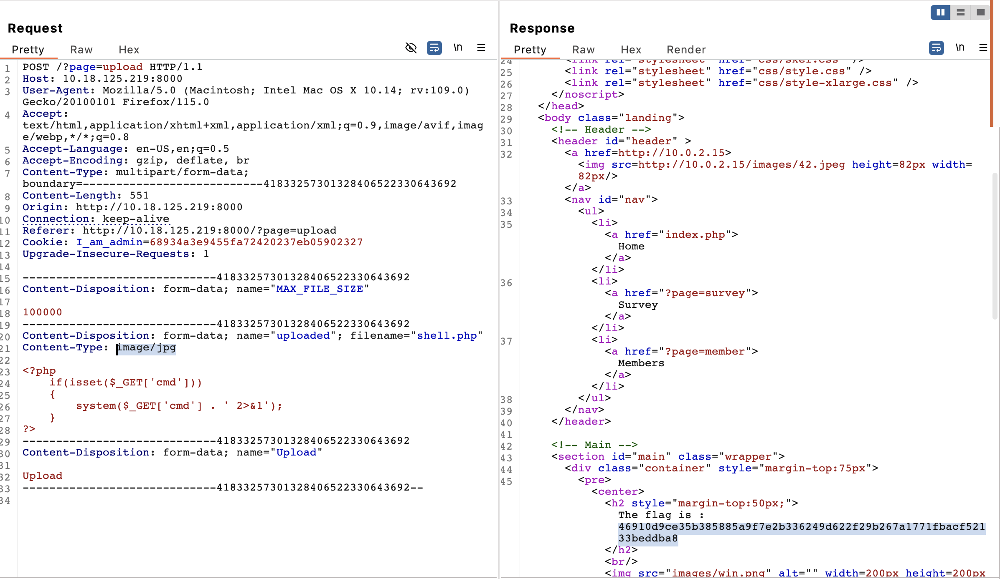

# Improper File Type Validation

## Issue

The upload page at "http://{IP}:{PORT}/index.php?page=upload" has a backend validation logic which only checks 'Content-Type' field in form submission. \
An attacker can intercept the request and change the 'Content-Type' field to 'image/jpeg' to allow for any type of file to be uploaded to server.

## Attack Vector

1 - Navigate to "http://{IP}:{PORT}/index.php?page=upload"

2 - Select malicious file or non image file to upload, e.g shell.php used in PoC below

3 - Open BurpSuite to intercept HTTP request

4 - Click 'Upload' in browser and view the request in BurpSuite

5 - Ammend the 'Content-Type' field to 'image/jpeg' and send request

6 - The file upload is accepted and the flag is revealed

*NOTE - As an alternative to BurpSuite in FireFox, you can open Web Developer Tools and go to the 'Network' tab. \
Identify the upload POST request, right click it and select 'Edit and Resend'. \
In the 'Body' portion of the new request ensure 'Content-Type:' is 'image/jpeg' \
Click send and the 'Response' tab should reveal that the file upload was successful.*

## PoC

## Mitigation

Ensure multiple file type validation mechanisms to avoid circumvention of checks such as: 
* Check content type field (MIME Type)
* Check file name field extension types
* Check 'Magic Bytes' which identifies the type of file being uploaded 
* Whitelisted extensions only

