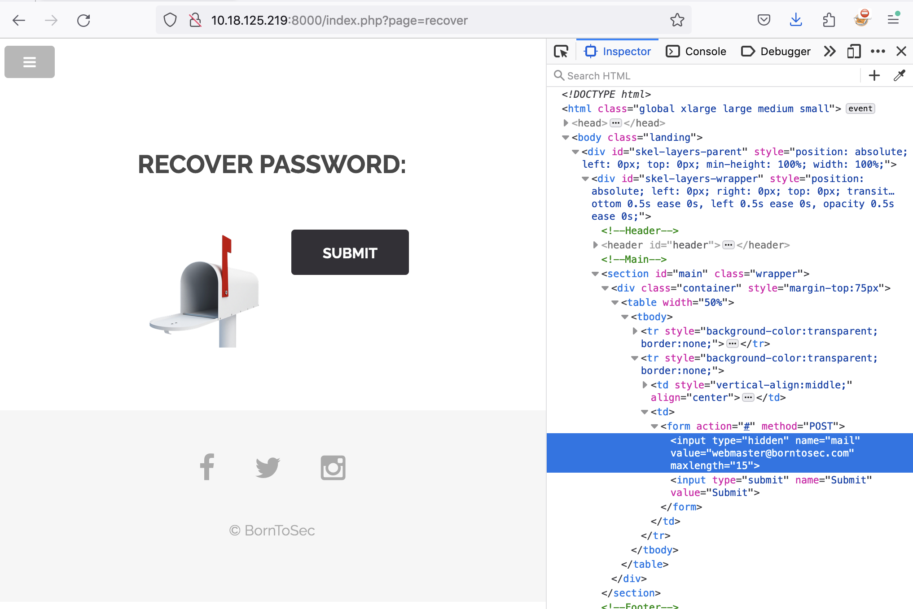
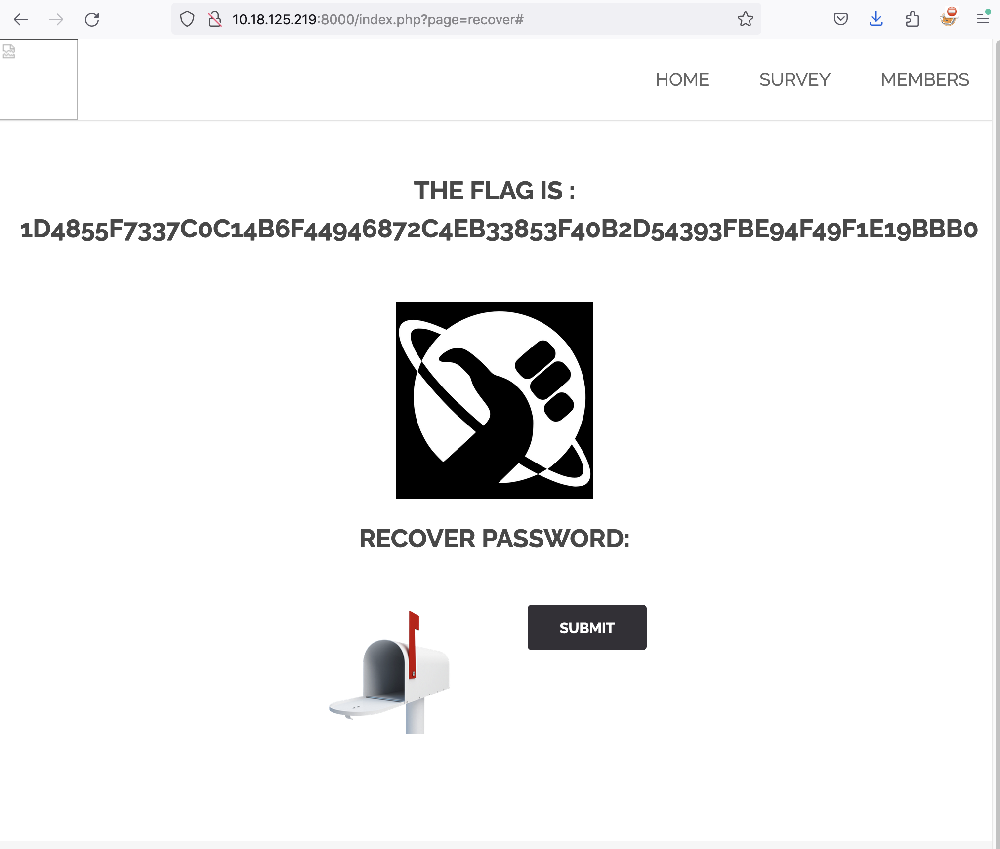

# Sensitive Data Disclosure

## Issue

The 'Recover Password' page at "http://{IP}:{PORT}/index.php?page=recover" contains a hidden input field \
for the 'mail' input required to reset the password. The default value in the field reveals the email \
for the webmaster of the website. This information can potentially be used to attempt to gain access or brute-force \
the website.

## Attack Vector

1 - Navigate to http://{IP}:{PORT}/index.php?page=recover

2 - Open Web Developer Tools in browser

3 - Search for `<input type="hidden" name="mail" value="webmaster@borntosec.com" maxlength="15">`

4 - Change the value field to any other email

5 - Click Submit

6 - Flag revealed is `1d4855f7337c0c14b6f44946872c4eb33853f40b2d54393fbe94f49f1e19bbb0`

## PoC

## Mitigation

1 - Remove default value from input element and make the input element visible

