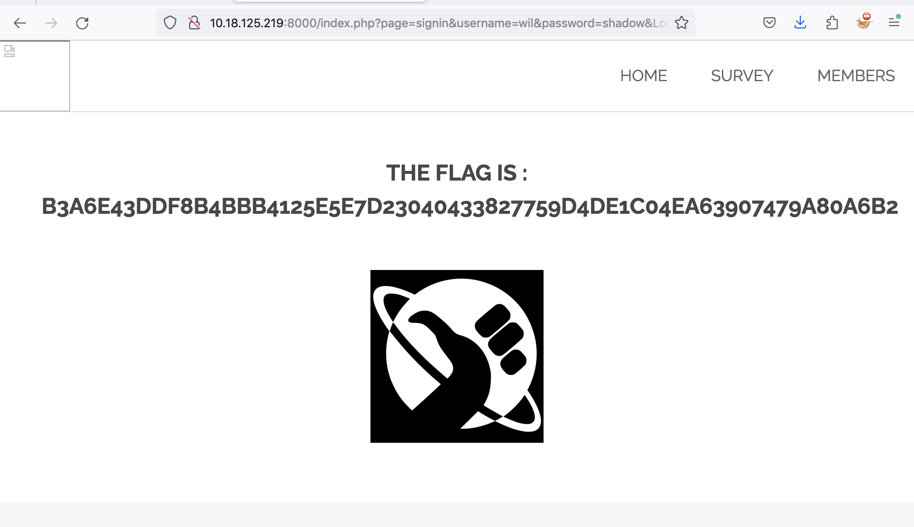

# Weak Credentials Sign In Page

## Issue

The 'SignIn' page at "http://{IP}:{PORT}/index.php?page=signin" does not restrict the number \
of login attempts and does not lock user account after numerous failed logins. \
This allows for a brute force attack to obtain user credentials. Furthermore, \
with weak password policies in place, likelihood of brute forcing a login is increased.

## Attack Vector

1 - Enumerate the website to identify potential user names. We identified potential username 'wil' visible on feedback page at "http://{IP}:{PORT}/index.php?page=feedback"

2 - Use our 'brute_force.py' script with a strong password list. As per script instructions, we recommend rockyou.txt list from GitHub. Make sure to adjust the URL in the script to correct one.

3 - Open bash and navigate to script directory. Launch script with `python3 brute_force.py`

4 - The script will attempt to login as 'wil' using every password from the password list

5 - If a successful login is found, the password is revealed. In this case the credentials found were `wil:shadow`

6 - Login using credentials

7 - Flag revealed is `b3a6e43ddf8b4bbb4125e5e7d23040433827759d4de1c04ea63907479a80a6b2`

*NOTE - You can use existing brute force tools such as Hydra, BurpSuite Intruder and Medusa*

## PoC

## Mitigation

1 - Restrict login attempts from a particular IP with rate limiting

2 - Lock user account after numerous unsuccessful login in attempts

3 - Implement CAPTCHA challenge

4 - Implement Multi-Factor Authentication

5 - Require strong password policies

