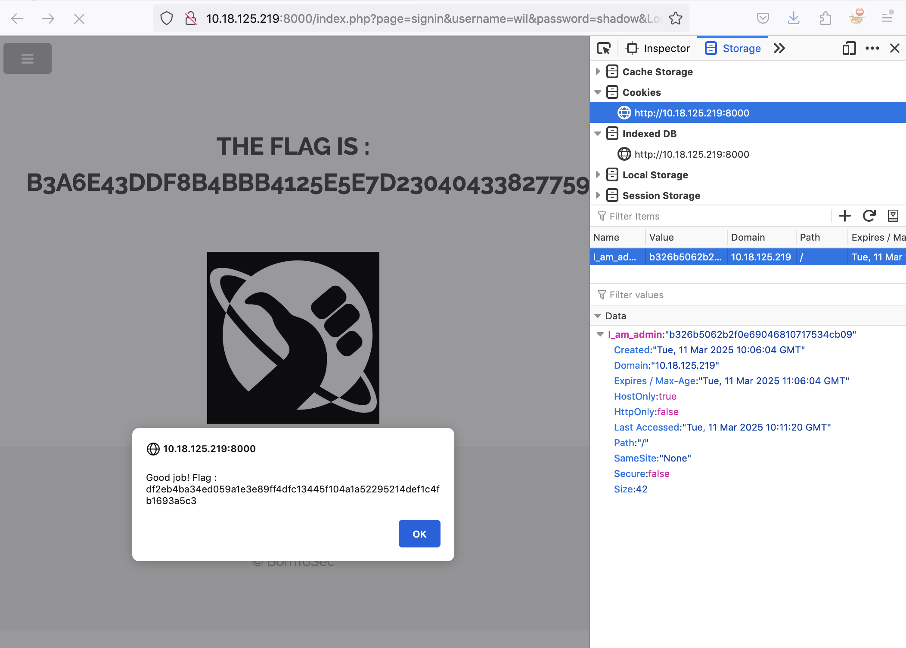

# Insecure Admin Cookie Setting

## Issue

Examining the website cookies reveals 'I_am_admin' cookie has a value appearing to be an md5 hash. 
This hash value can be ammended ultimately setting the session user as admin.

## Attack Vector

1 - Confirm the cookie value by open Web Developer Tools and examining cookies set in storage.

2 - The cookie is set as '68934a3e9455fa72420237eb05902327' which appears to be md5. We suspect it is hash of 'false' so we confirm with folowing script.

3 - Open bash and navigate to script directory. Launch script with `python3 md5encodeandcheck.py`

4 - The script will encode the word 'false' to examine if md5 hash matches the existing cookie value of '68934a3e9455fa72420237eb05902327'

5 - After confirmation it will provide md5 hash of 'true'. 

6 - Back in browser Web Developer Tools set the value of 'I_am_admin' cookie to md5 hash value of 'true' which is 'b326b5062b2f0e69046810717534cb09'

7 - Refresh page and flag is revealed

*NOTE - You can use existing MD5 decryption tools such as MD5decrypt.net which will check hashes of words in a wordlist instead of \
the md5encodeandcheck.py script which only examines the word 'false'*

## PoC

## Mitigation

1 - Implement  strong hashing algorithms for session management

2 - Use server side session management which randomizes a token to validate if user is authorised for admin access

