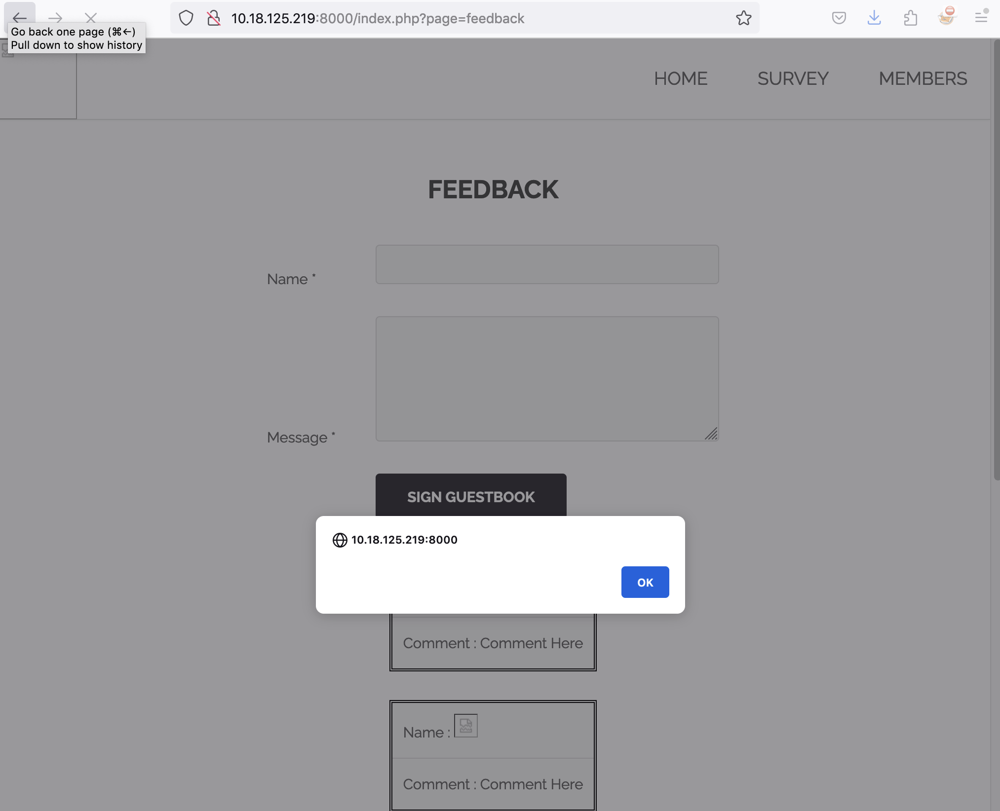
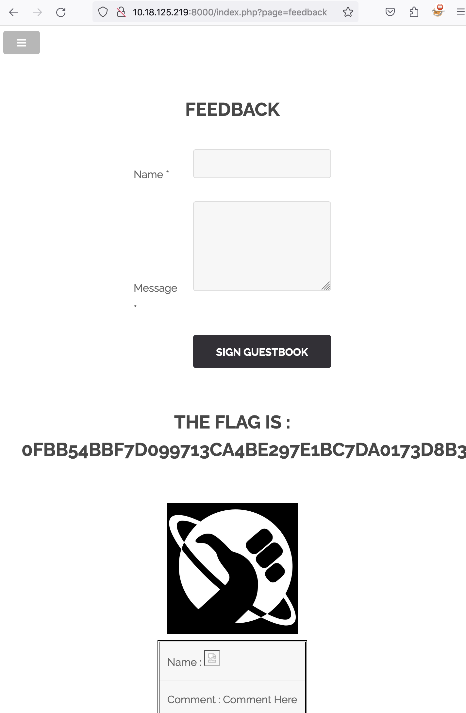

# Stored XXS In Feedback Form

## Issue

The feedback form 'Name' field  at "http://{IP}:{PORT}/index.php?page=feedback" does not sanitize input data which is submitted and reflected on the page.
Furthermore the input data is stored on the server thus XSS is persisted and anybody accessing the page is vulnerable to be exploited.

## Attack Vector

1 - Navigate to "http://{IP}:{PORT}/index.php?page=feedback" and enter payload in 'Name' field `<b>XSS`. Enter any data in 'Message' field. Click 'Sign Guestbook'

2 - The javascript renders the data to the page and you see that the html code submitted in step one is rendered to the page as 'XSS' is shown as bold.

3 - Refresh the page to see if the data is stored and that the XSS is persistent. 

4 - We cannot use payload `` in name field directly as the number of characters is restricted. The 'Message' field seems to be filtering out html tags so we focus on the 'Name' field.

5 - Open BurpSuite and write another message and click sign guestbook. Intercept the POST request in BurpSuite.

6 - In the request, change the payload to `txtName=&mtxtMessage=Comment+Here&btnSign=Sign+Guestbook` and click send.

7 - Go back to the browser page and hit refresh. You will get a popup confirming the XSS was successful, however the flag may not appear.

8 - To trigger the flag, leave an ordinary comment with any text whatsoever. After signing guestbook, the flag is revealed.

9 - Flag is `0fbb54bbf7d099713ca4be297e1bc7da0173d8b3c21c1811b916a3a86652724e`

*_NOTE - You can also trigger the flag by just typing 'alert' in the name or comment field. This is a bug and does not validate the vulnerability!_* \
*_Alternatively after you use the initial payload `<b>XSS` in name field, hit refresh and leave an ordinary comment and the flag is revealed :\)_*

## PoC

## Mitigation

1 - Sanitize and validate input

2 - Encode troublesome characters before rendering to browser

3 - Enforce strict CSP
