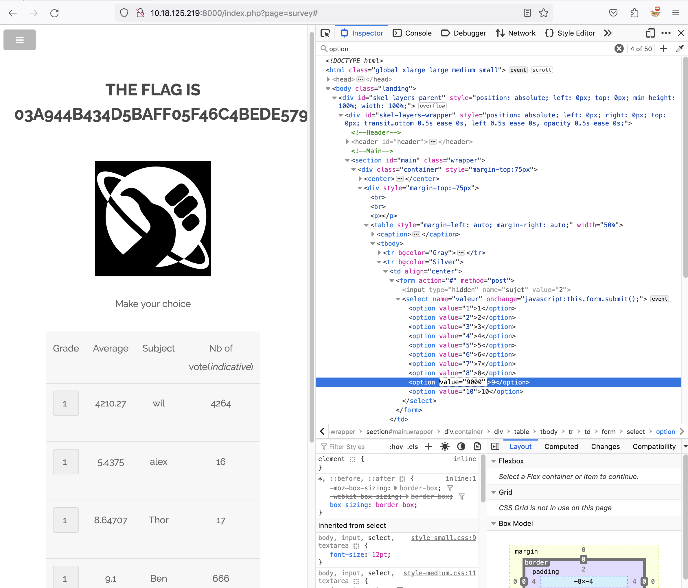

# Insecure Input In Survey Page

## Issue

The 'Grade' option fields at "http://{IP}:{PORT}/index.php?page=survey" is subject to having the values manipulated resulting in loss of data integrity.

## Attack Vector

1 - Navigate to "http://{IP}:{PORT}/index.php?page=survey" and open Web Developer Tools then select 'Inspector Tab'

2 - Look for `<option value="2">2</option>` and set value field to any number e.g `<option value="9999999999">2</option>`

3 - On the survey page select '2' option for grade in anyone of the rows.

4 - The appended value is then submitted and the flag revealed.

9 - Flag is `03a944b434d5baff05f46c4bede5792551a2595574bcafc9a6e25f67c382ccaa`

## PoC

## Mitigation

1 - Validate input on server side by restricting input to defined options

2 - Check for input tampering e.g if value and selection text don't match
