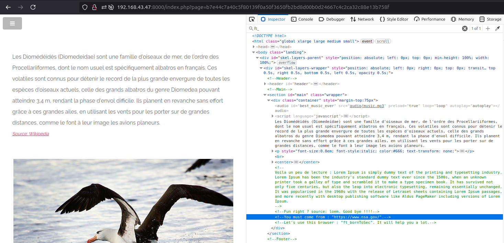

# Spoofing Referer and User-Agent

## Issue

Manipulating Referer and User-Agent HTTP header at page "http://{IP}:{PORT}/index.php?page=b7e44c7a40c5f80139f0a50f3650fb2bd8d00b0d24667c4c2ca32c88e13b758f" \
 reveals sensitive information in HTML code which leads to this exploit.

## Attack Vector

1 - Navigating to "http://{IP}:{PORT}/index.php?page=media&src=nsa" reveals a link to "http://{IP}:{PORT}/index.php?page=b7e44c7a40c5f80139f0a50f3650fb2bd8d00b0d24667c4c2ca32c88e13b758f"

2 - Folowing link to this page we examine the source code and find the following comments in html code: \
`<!--You must come from : "https://www.nsa.gov/".-->` and `<!--Let's use this browser : "ft_bornToSec". It will help you a lot.-->`

3 - We set the Referer Header in HTTP Request to "https://www.nsa.gov/"

4 - We set the User-Agent Header in HTTP Request to "ft_bornToSec"

5 - After submitting the request the flag is revealed.

6 - Flag is `f2a29020ef3132e01dd61df97fd33ec8d7fcd1388cc9601e7db691d17d4d6188`

_* NOTE: You can use a browser extension such as 'Modify Header Value' on Firefox to change header values *_

## PoC

## Mitigation

1 - Validate input on server side by restricting input to defined options

2 - Check for input tampering e.g if value and selection text don't match
