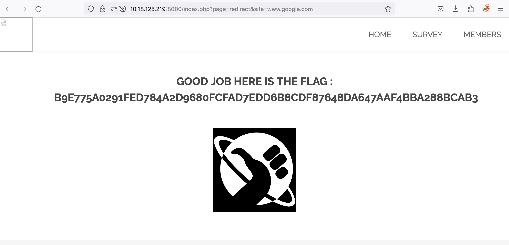

# Open Redirect

## Issue

The URL "http://{IP}:{PORT}/index.php?page=redirect&site=" allows for the value in 'site' parameter to be any url \
This creates the risk of phishing attacks with an attacker being able to redirect a user to a malicious page using a non malicious url for initial engagement.

## Attack Vector

1 - Examining the HTML Code on the main page reveals that redirects are managed through the site parameter query string in redirect page \
 "http://{IP}:{PORT}/index.php?page=redirect&site="

2 - We modify the 'site' parameter value to test if the redirect is to any page `"http://{IP}:{PORT}/index.php?page=redirect&site=www.google.com"`

3 - The flag is revealed.

4 - Flag is `b9e775a0291fed784a2d9680fcfad7edd6b8cdf87648da647aaf4bba288bcab3`

## PoC

## Mitigation

1 - Validate and whitelist URLs

2 - Restrict to internal URLs using relative URLs