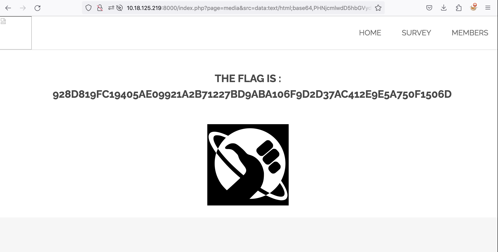

# XSS in Media Object

## Issue

The URL "http://{IP}:{PORT}/index.php?page=media&src=nsa" embeds content onto the page and passing through different value in 'src' parameter can \
render malicious content on page.

## Attack Vector

1 - Examining the HTML Code at "http://{IP}:{PORT}/index.php?page=media&src=nsa" and changing the 'src' value reveals the value is reflected in html code. \
`<object data="thisismyvalueinput"></object>`

2 - We try different payloads to try and break out of the tags but are unsuccessful. We find most payloads are filtered so we try data urls as per `https://developer.mozilla.org/en-US/docs/Web/URI/Reference/Schemes/data` 

3 - `src=data:text/html,` seems to demonstrate XSS but does not reveal the flag. 

4 - We attempt to base64 encode the request with `src=data:text/html;base64,PHNjcmlwdD5hbGVydCgnWFNTJyk8L3NjcmlwdD4=` and the flag is revealed

4 - Flag is `928d819fc19405ae09921a2b71227bd9aba106f9d2d37ac412e9e5a750f1506d`

## PoC

## Mitigation

1 - Validate and validate input

2 - Use CSP to prevent unauthorized scripts

3 - Avoid object tag injection

4 - Reject data URLS
