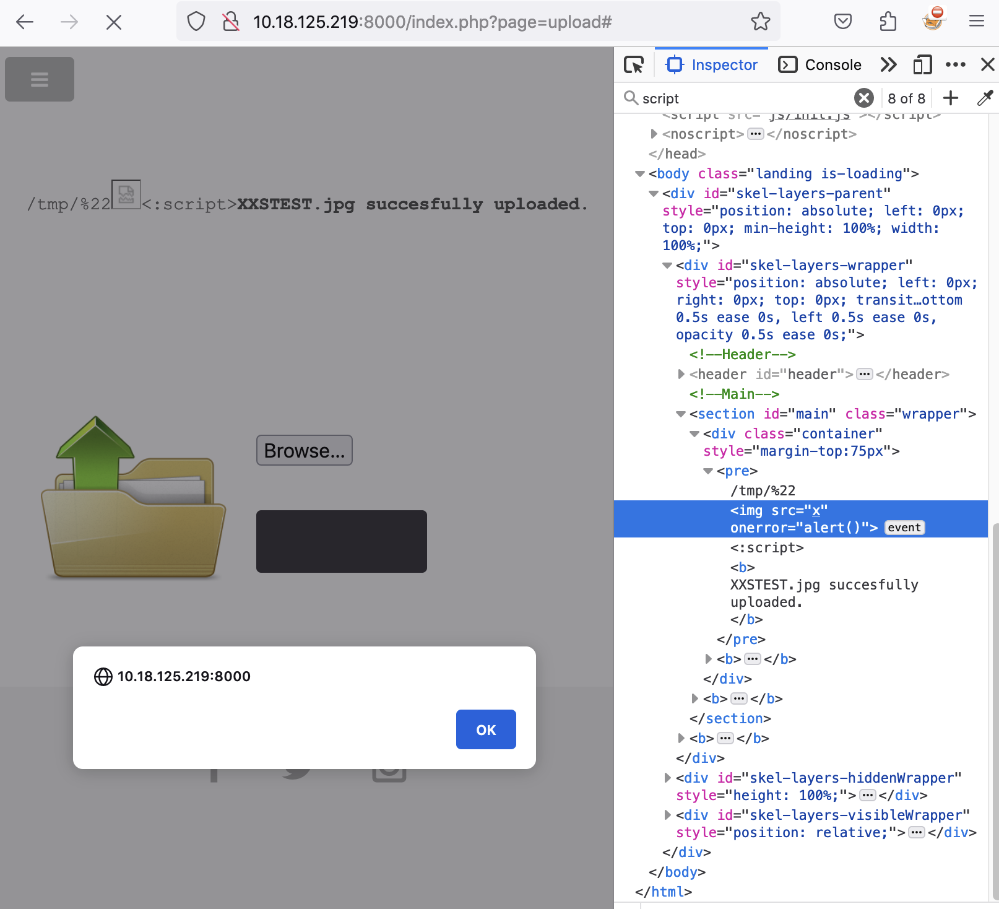

# XSS In File Upload Page

## Issue

The upload file page at "http://{IP}:{PORT}/index.php?page=upload" does not sanitize the file name which is submitted and reflected on the page.

## Attack Vector

1 - Navigate to "http://{IP}:{PORT}/index.php?page=upload" and upload a file with the name `<:script><b>XXSTEST.jpeg`

2 - The html code is rendered to the page

## PoC

## Mitigation

1 - Sanitize and validate input

2 - Encode troublesome characters before rendering to browser

3 - Enforce strict CSP
